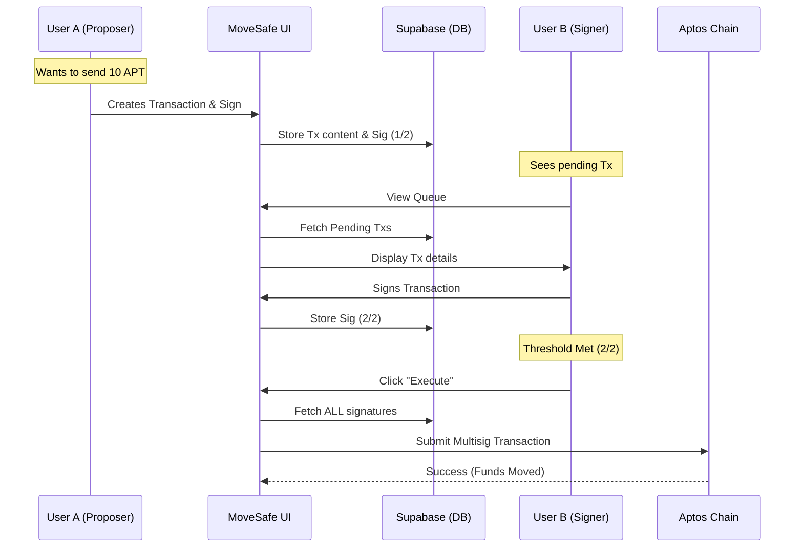

# MoveSafe 🛡️

**The Native Multisig Treasury for Movement Network**

[](https://movementlabs.xyz)
[](LICENSE)
[](https://github.com/yourusername/movesafe)

**MoveSafe** is a next-generation multisig wallet application designed specifically for the **Movement Network** (Aptos Ecosystem). Unlike traditional multisig solutions that rely on complex, gas-heavy smart contracts, MoveSafe leverages Aptos's native `MultiEd25519` cryptographic primitives to create lightweight, secure, and gas-efficient shared accounts.

---

## 📑 Table of Contents
- [✨ Key Features](#-key-features)
- [🏗️ System Architecture](#-system-architecture)
- [🛠️ Tech Stack](#-tech-stack)
- [🚀 Getting Started](#-getting-started)
- [📦 Database Schema](#-database-schema)
- [📝 Usage Guide](#-usage-guide)
- [🔧 Troubleshooting](#-troubleshooting)
- [🤝 Contributing](#-contributing)

---

## ✨ Key Features

### 🔐 Native Security
- **No Smart Contract Risk**: MoveSafe does not deploy custom smart contracts for the Safe itself. Instead, it uses **Native Accounts** derived from cryptographic multi-signatures (`MultiEd25519`).
- **Chain-Level Enforcement**: The blockchain itself enforces the K-of-N signature requirement (e.g., 2 out of 3 owners must sign).

### 👥 Seamless Onboarding
- **Invite Mode**: Create a Safe and share a unique magic link with your team. They can join instantly by connecting their wallet.
- **Manual Mode**: For power users, manually input the Hex Public Keys of all owners to instantiate the Safe immediately.

### 💸 Transaction Management
- **Visual Queue**: Track pending transactions, see who has signed, and who is holding up the queue.
- **Off-Chain Coordination**: Signatures are collected off-chain (gasless) via Supabase and only verified on-chain during execution.
- **Address Book**: Automatically tracks safes you belong to locally and via the backend.

### 🎨 Minimalist Design
- Built with a focus on **Professional Simplicity**.
- **Dark Mode** native support.
- Responsive design for desktop (mobile support in roadmap).

---

## 🏗️ System Architecture

MoveSafe employs a **Hybrid Web3 Architecture** to bridge the gap between user experience and blockchain security.



| Component | Role | Security Property |
| :--- | :--- | :--- |
| **Frontend** | UI/UX, Wallet Connection | Non-Custodial |
| **Supabase** | Coordination Layer which stores pending transactions and partial signatures. | Trust-minimized (DB cannot forge signatures, only delete them. Deletion just requires re-signing). |
| **Aptos Chain** | Execution Layer. Verifies the aggregated signature matches the Safe's public key. | Trustless & Final. |

---

## 🛠️ Tech Stack

### Frontend Application
- **Framework**: [Next.js 16 (App Router)](https://nextjs.org/)
- **Language**: TypeScript (Strict Mode)
- **Styling**: [Tailwind CSS v4](https://tailwindcss.com/) + [Lucide Icons](https://lucide.dev/)
- **State Management**: React Hooks + Local Storage (Fallback)

### Blockchain Integration
- **SDK**: [`@aptos-labs/ts-sdk` (v1.9+)](https://github.com/aptos-labs/aptos-ts-sdk)
- **Wallet Adapter**: [`@aptos-labs/wallet-adapter-react`](https://github.com/aptos-labs/aptos-wallet-adapter)
- **Network**: Movement Bardock Testnet / Aptos Testnet

### Backend Infrastructure
- **Platform**: [Supabase](https://supabase.com)
- **Database**: PostgreSQL
- **Realtime**: Postgres Changes (for live updates on signatures)

---

## 🚀 Getting Started

Follow these steps to set up MoveSafe locally.

### 1. Prequisites
- **Node.js** (v18 or higher)
- **npm** or **yarn**
- A **Supabase** account (Free tier is sufficient)
- An **Aptos Wallet** (Petra, Pontem, or Nightly)

### 2. Clone the Repository
```bash
git clone https://github.com/yourusername/movesafe.git
cd movesafe
```

### 3. Install Dependencies
```bash
npm install
# or
yarn install
```

### 4. Configure Environment Variables
Create a `.env.local` file in the root directory:

```env
# .env.local

# Connect to your Supabase Project
NEXT_PUBLIC_SUPABASE_URL="https://your-project.supabase.co"
NEXT_PUBLIC_SUPABASE_ANON_KEY="your-anon-key-here"

# Optional: Movement Network Config (Defaults to Testnet if omitted)
NEXT_PUBLIC_NETWORK="testnet" 
```

### 5. Setup Database (Supabase)
Go to your Supabase Project -> **SQL Editor** and run the following script to initialize the tables:

```sql
-- 1. Safes Table
-- Stores the metadata for created safes.
create table public.safes (
  address text primary key,          -- The derived Native Address of the safe
  name text not null,                -- User-friendly name
  threshold integer not null,        -- K (signatures required)
  owners text[] not null,            -- Array of Hex Public Keys (N owners)
  created_at timestamp with time zone default timezone('utc'::text, now())
);

-- 2. Safe Drafts (Invite Mode System)
-- Temporary storage for safes being built via invites.
create table public.safe_drafts (
  id uuid default gen_random_uuid() primary key,
  name text,
  threshold integer,
  owner_limit integer,
  owners text[],                     -- Public keys collected so far
  status text default 'DRAFT',       -- DRAFT -> READY -> CREATED
  admin_token text,                  -- Secret token for the creator to manage the draft
  join_token text,                   -- Public token for link sharing
  created_at timestamp with time zone default timezone('utc'::text, now())
);

-- 3. Transactions 
-- Off-chain storage for proposed transactions.
create table public.transactions (
  id uuid default gen_random_uuid() primary key,
  safe_address text references public.safes(address),
  payload jsonb not null,            -- The serialized transaction payload (Move Script/Entry Function)
  status text default 'PENDING',     -- PENDING -> EXECUTED -> FAILED
  created_at timestamp with time zone default timezone('utc'::text, now())
);

-- 4. Signatures
-- Stores the Ed25519 signatures for pending transactions.
create table public.signatures (
  id uuid default gen_random_uuid() primary key,
  transaction_id uuid references public.transactions(id) on delete cascade,
  signer_address text not null,
  signature_hex text not null,       -- The 64-byte signature
  created_at timestamp with time zone default timezone('utc'::text, now()),
  unique(transaction_id, signer_address) -- Prevent double signing
);
```

### 6. Run the Dev Server
```bash
npm run dev
```
Access the app at `http://localhost:3000`.

---

## � Usage Guide

### Creating a Safe
1.  Navigate to **Create Safe**.
2.  Choose **Invite Mode** (easier) or **Manual Mode** (faster if you have keys).
3.  **Invite Mode**: Share the generated link. Once all owners join, click "Finalize".
4.  **Manual Mode**: Paste the Ed25519 Public Keys of all owners.
5.  Set the **Threshold** (e.g., 2 out of 3).
6.  Click **Create**. The Safe Address is derived deterministically.

### Sending Assets
1.  Go to your Safe Dashboard.
2.  Click **New Transaction**.
3.  Enter the **Recipient Address** and **Amount**.
4.  Review and Click **Create**. This will prompt your wallet to sign the proposal (off-chain).
5.  The transaction now appears in the **Queue**.

### Signing & Executing
1.  Other owners navigate to the Safe Dashboard.
2.  They see the pending transaction in the **Queue**.
3.  They click **Confirm/Sign**.
4.  Once the signature count meets the threshold, the status changes to **Ready**.
5.  Any owner can click **Execute**. This submits the payload + aggregated signatures to the blockchain.

---

## 🔧 Troubleshooting

**"Failed to fetch" on startup?**
- Ensure your Supabase URL and Key in `.env.local` are correct.
- Check browser console. If it's a Wallet Adapter error, make sure you have a compatible wallet (Petra/Pontem) installed.

**"Signature Verification Failed"?**
- Ensure you are signing with the *exact* account that is listed as an owner.
- Aptos addresses and Public Keys are different. The Safe stores **Public Keys**. Ensure you provided public keys during creation, not addresses.

**Styles look broken?**
- We use Tailwind v4 in `globals.css`. Ensure your editor supports it.
- Try deleting `.next` folder and restarting `npm run dev`.

---

## 🤝 Contributing

We welcome contributions! Please follow these steps:

1.  Fork the repo.
2.  Create a feature branch (`git checkout -b feature/amazing-feature`).
3.  Commit your changes.
4.  Push to the branch.
5.  Open a Pull Request.

---

## License

And of course: **Use at your own risk.** This is beta software on a Testnet environment.
MIT License © 2024 MoveSafe Team.
