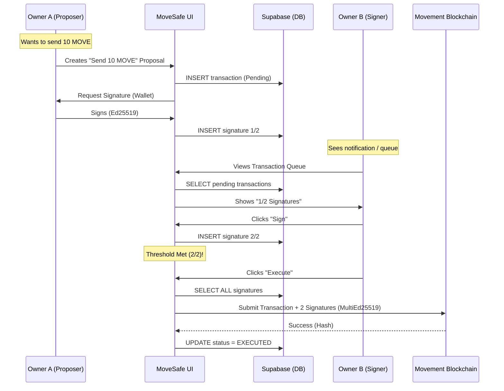

# MoveSafe Frontend Application

This directory contains the **Next.js 14** frontend application for MoveSafe.

## 🛠️ Development Guide

### 1. Installation
Navigate to this directory and install dependencies:
```bash
npm install
```

### 2. Environment Setup
Copy `example.env` to `.env.local` and fill in your keys:
```bash
cp example.env .env.local
```
Required variables:
- `NEXT_PUBLIC_SUPABASE_URL`
- `NEXT_PUBLIC_SUPABASE_ANON_KEY`
- `NEXT_PUBLIC_MOVEMENT_NETWORK` (custom/testnet)
- `NEXT_PUBLIC_TREASURY_ADDRESS` (for safe creation fees)

### 3. Running Locally
Start the development server:
```bash
npm run dev
```
Open [http://localhost:3000](http://localhost:3000).

## 📂 Architecture & Structure

This project follows a **Feature-based Architecture** to keep things modular.

### `src/app` (App Router)
- **`layout.tsx`**: Main entry point, providers (Wallet, Toast).
- **`page.tsx`**: Connect Wallet landing page.
- **`dashboard/page.tsx`**: The main Safe Dashboard.
- **`create/page.tsx`**: Flow for creating a new Safe.
- **`join/[id]/page.tsx`**: Invite link handling.

### `src/components`
- **`features/`**: Domain-specific components.
    - **`dashboard/`**: `TransactionQueue`, `History`, `Sidebar` (Modular Dashboard).
    - **`safe/`**: Logic for Safe creation and drafts.
    - **`transaction/`**: `NewTransactionModal`, `QueueItem`.
    - **`wallet/`**: Wallet connection logic.
- **`ui/`**: Generic, reusable UI components (Buttons, Cards, Inputs).

### `src/lib` (Utilities)
- **`multisig.ts`**: Core logic for `MultiEd25519` key generation and signature aggregation.
- **`supabase.ts`**: Supabase client instance and type definitions.
- **`movement.ts`**: Aptos SDK instance (v5) configured for Movement Network.
- **`errorMessages.ts`**: Centralized error handling and user-friendly messages.

### `src/hooks`
- **`useTransaction`**: Custom hook for handling transaction proposals.
- **`useMovePrice`**: Fetches real-time MOVE price.


## 📊 System Architecture (Sequence Diagram)

How MoveSafe orchestrates multi-signature transactions off-chain:



## 🧪 Scripts

- `npm run dev`: Start dev server.
- `npm run build`: Build for production (Vercel).
- `npm run lint`: Run ESLint.
